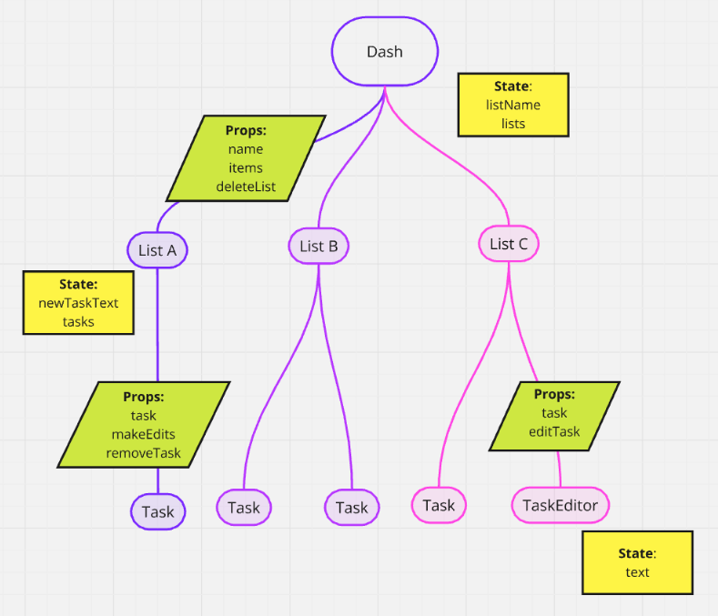

# TODOs App

## Steps

Create a TODOs Dashboard where you can manage multiple TODO Lists.

This project will use all our skills so far: HTML, CSS, SASS, JavaScript, and React (components, state, and hooks).

Make sure your lists are persisted in Local Storage using the included useLocalStorage hook.

Create the following components in the `/components` folder.

- Dash (already added for you)
- List
- Task
- TaskEditor

Think about how to organize the data. What should be state? Where should it live?

Here's a diagram to help out with the though process:



Here's what your task data should look like:

```javaScript
const task = {
  id: '1234'
  summary: 'walk the dog',
  complete: false,
  editing: false
}
```

You'll need to use the built-in React hooks: useState and useEffect. (You won't need useContext for this.)

I've included the styling for the Neumorphism look. Feel free to use it or come up with your own style.

Also, feel free to add Font awesome icons where it makes sense (e.g. you might add a plus button next to the word 'add'.) If you use icons, also include words since this is the best design practice. Icons by themselves can be confusing to the user.

### TODOs App ScreenShot


## Setup

### Clone it

```bash
git clone git@gitlab.lowell.perseverenow.org:persevere-01/projects/todos-app.git
```

### Update GIT remote

Update the GIT remote value using the following ...

```bash
git remote set-url origin git@gitlab.lowell.perseverenow.org:persevere-01/projects/todos-app.git
```

#### Useful Git commands for checking and setting the remote origin URL:

| Action    | Command                           |
| --------- | --------------------------------- |
| Check it  | `git remote show origin`          |
| Update it | `git remote set-url origin <url>` |

### Install dependencies

```bash
 npm install --registry http://192.168.1.49:4873
```

## Running the project

### Starting your project

Switch into the project folder ...

```bash
cd todos-app
```

Then enter ...

```bash
npm run dev
```

### Open your web app in the browser

Navigate to the specified URL in the browser (e.g. http://localhost:5173/).

### Stopping the project

Just hit `ctrl+c` to stop running your React project.

## Using Font Awesome Icons

### Docs

[See the Docs](https://docs.fontawesome.com/v5/web/use-with/react/)

### Avaiable Icons

We have the following icon packages available:

- @fortawesome/free-solid-svg-icons
- @fortawesome/free-regular-svg-icons
- @fortawesome/free-brands-svg-icons

### Font Awesome Icon usage

To use these with React, first import the `FontAwesomeIcon` component. Then import any icons you'd like to use.
Then just add the FontAwesomeIcon to the jsx and pass it the name of the icon you want via the icon prop.

```jsx
import { FontAwesomeIcon } from '@fortawesome/react-fontawesome';
import { faPenNib, faEnvelope, faCoffee } from '@fortawesome/free-solid-svg-icons';

export default function App() {
  return (
    <div>
      <h3>How to use font-awesome in react</h3>
      <FontAwesomeIcon icon={faPenNib} size="3x" />
      <FontAwesomeIcon icon={faEnvelope} pulse />
      <FontAwesomeIcon icon={faCoffee} spin />
    </div>
  )
}

export default IconPage
```

#### Sizing

```jsx
<FontAwesomeIcon icon="coffee" size="xs" />
<FontAwesomeIcon icon="coffee" size="lg" />
<FontAwesomeIcon icon="coffee" size="6x" />
```

Note that icon size can be controlled with the CSS `font-size` attribute, and FontAwesomeIcon’s `size` prop determines icon size relative to the current `font-size`.

#### Rotating Icons

```jsx
<FontAwesomeIcon icon="coffee" rotation={90} />
<FontAwesomeIcon icon="coffee" rotation={180} />
<FontAwesomeIcon icon="coffee" rotation={270} />
```

#### Animating Icons

```jsx
<FontAwesomeIcon icon="spinner" spin />
<FontAwesomeIcon icon="spinner" pulse />
```

#### Adding Classes Yourself

You can add classes for your own project purposes and styling to any component using the className property.

```jsx
<FontAwesomeIcon icon="spinner" className="highlight" />
```

## Adding/ Updating packages

For react ...

```bash
npm install react@latest react-dom@latest --registry http://npm.perseverenow.org/ppm/
```

For react dev dependencies...

```bash
npm install @types/react@latest @types/react-dom@latest --save-dev --registry http://npm.perseverenow.org/ppm/
```

For vite ...

```bash
npm install vite@latest @vitejs/plugin-react-swc@latest --save-dev --registry http://npm.perseverenow.org/ppm/
```

Other ...

```bash
npm install jsdom globals --save-dev --registry http://npm.perseverenow.org/ppm/
```

For linting...

```bash
npm install @eslint/js@latest eslint@latest eslint-plugin-react@latest eslint-plugin-react-hooks@latest eslint-plugin-react-refresh@latest --save-dev --registry http://npm.perseverenow.org/ppm/
```

For unit testing...

```bash
npm install vitest@latest @vitest/coverage-v8@latest @testing-library/jest-dom@latest @testing-library/react@latest @testing-library/user-event@latest --save-dev --registry http://npm.perseverenow.org/ppm/
```

For Font Awesome...

```bash
npm install @fortawesome/fontawesome-svg-core@latest @fortawesome/free-brands-svg-icons@latest @fortawesome/free-regular-svg-icons@latest @fortawesome/free-solid-svg-icons@latest @fortawesome/react-fontawesome@latest --save-dev --registry http://npm.perseverenow.org/ppm/
```

For React Router...

```bash
npm install react-router@latest --registry http://npm.perseverenow.org/ppm/
```

For MUI...

```bash
npm install @mui/material @emotion/react @emotion/styled --registry http://npm.perseverenow.org/ppm/
```

For MUI icons...

```bash
npm install @mui/icons-material@latest --registry http://npm.perseverenow.org/ppm/
```

## Vite config proxy setup

This uses the following proxy setup in vite.config.js to make the browser think the frontend and backend are on the same origin.

```js
  server: {
    proxy: {
      /* Redirects frontend /api/your-endpoint calls to
         backend http://localhost:3000/api/your-endpoint */
      '/api': 'http://localhost:3000',
    },
  },
```

Vite config is setup to map calls to `/api/some-endpoint` from React to `http://localhost:3000/api/some-endpoint` on the backend.

To strip off the /api in the Request URL sent to the backend, the following change can be made in Vite config. Otherwise, just prefix all the routes on the backend with `/api`. This is probably preferred since it will make versioning easier with `/api/v2`.

```js
    proxy: {
      '/api': {
        target: 'http://localhost:3000',
        changeOrigin: true,
        // This removes '/api' from the path before sending to Express
        rewrite: (path) => path.replace(/^\/api/, ''),
      },
    },
```

For producton, this proxy setup in vite config would be removed and the backend configurations for cors and the cookies would be updated to be more secure. The `secure` property would be set to true when creating the cookies and a 'https' cert would be needed.
